### Université de Versailles Saint-Quentin-en-Yvelines

### **IUT DE VELIZY, Département Informatique**

**Auteur :** `Lucas DA SILVA FERREIRA`  
**Classe :** `INFO3 - FI`  
**Date :** `11 Décembre 2024`

Note Importante : Ce rapport à été reformulé plus clairement à l'aide de ChatGPT et à été **<u>relu minutieusement</u>** en connaissance de cause d'une bonne transmission et d'une bonne expression de ce que j'ai appris lors de ce cours et de prévenir tout phénomène d'hallucination éventuel de la part de ce modèle.

# **Compte Rendu 2  - Développement Avancé**

<br>

## Sommaire

- [0. Introduction](#introduction)
- [0bis. Architecture matérielle](#architecture-materielle)
- [1. Méthode MC](#methode-mc)
- [2. Algorithmes et Paradigmes employés](#algo-et-paradigme)
  - [2.1. Iteration](#iteration)
  - [2.2. MasterWorker](#masterworker)
- [3. Mise en œuvre sur Machine Partagée](#mise-en-oeuvre-sur-machine-partage)
  - [3.1. Analyse Assignment 102](#analyse-assignment-102)
    - [3.1.1. Classes principales](#classes-principales)
    - [3.1.2. Utilisation du package `Concurrent`](#utilisation-du-package-concurrent)
    - [3.1.3. Paradigme choisi](#paradigme-choisi)
    - [3.1.4. Gestion des tâches dans Assignment102](#gestion-des-taches-dans-assignment102)
    - [3.1.5. Optimisations possibles](#optimisations-possibles)
  - [3.2. Analyse de Pi.java](#analyse-pijava)
    - [3.2.1. Classes principales](#classes-principales-pi-java)
    - [3.2.2. Utilisation des outils `Concurrent`](#utilisation-des-outils-concurrent-pi-java)
    - [3.2.3. Paradigme choisi](#paradigme-choisi-pi-java)
    - [3.2.4. Gestion des tâches dans Pi.java](#gestion-des-taches-dans-pi-java)
    - [3.2.5. Comparaison entre Assignment102 et Pi.java](#comparaison-entre-assignment102-et-pi-java)
- [4. Qualité de test de perf](#qualite-de-test-de-perf)
  - [4.1. Définitions des métriques](#definitions-des-metriques)
  - [4.2. Paramètres et méthodologie](#parametres-et-methodologie)
  - [4.3. Automatisation et traitement des tests](#automatisation-et-traitement-des-tests)
  - [4.4. Résultats expérimentaux](#resultats-experimentaux)
  - [4.5. Observations](#observations)
  - [4.6. Rapport avec la norme Iso](#rapport-avec-la-norme-iso)
  - [4.7. Effectiveness sur Pi.java](#effectiveness-sur-pi-java)
  - [4.7bis. Analyse Comparée des Speed-Ups](#analyse-comparee-des-speed-ups)
- [5. Mise en œuvre en mémoire distribuée](#mise-en-oeuvre-en-memoire-distribuee)
  - [5.1. Java Socket MW](#java-socket-mw)
- [6. Perf MW](#perf-mw)
- [7. Parallélisation sur plusieurs machines](#parallelisation-sur-plusieurs-machines)
  - [7.1. Configuration et préparation des machines](#configuration-et-preparation-des-machines)
  - [7.2. Compilation et déploiement](#compilation-et-deploiement)
  - [7.3. Exécution et coordination](#execution-et-coordination)
  - [7.4. Optimisation : Multiplication des workers](#optimisation-multiplication-des-workers)
  - [7.5 Analyse des performances du Master Worker distribué](#analyse-perf-mw)
  - [7.6. Avantages de cette architecture](#avantages-de-cette-architecture)
  - [7.7. Illustration du fonctionnement](#illustration-du-fonctionnement)
- [8. Erreurs sur le nombre Pi par scripts et itérations](#erreurs-sur-le-nombre-pi)
- [9. Conclusion](#conclusion)

---

<br>

## 0. Introduction <a id="introduction"></a>

Ce rapport présente une exploration approfondie des techniques de calcul parallélisé pour résoudre le problème de l'approximation de la valeur de π à l'aide de la méthode Monte Carlo. Cette méthode statistique repose sur l'utilisation de points aléatoires pour évaluer la surface d'un cercle inscrit dans un carré.

Afin d'optimiser ce calcul, plusieurs paradigmes et approches ont été implémentés, incluant l'utilisation de multithreading, la distribution de calculs sur plusieurs machines, et l'exploitation de sockets pour coordonner les travailleurs distants. Les codes sources étudiés, tels que Pi.java, MasterSocket.java, Assignment102.java, et CsvWriter.java, illustrent ces différents aspects du développement avancé.

Nous avons structuré ce rapport pour suivre une progression logique : nous commencerons par décrire la méthode Monte Carlo (section 1) et les algorithmes employés (section 2). Nous examinerons ensuite la mise en œuvre de ces algorithmes sur des machines partagées, ainsi que leur adaptation pour des environnements distribués (sections 3 et 5). Enfin, nous évaluerons les performances obtenues grâce aux tests et à la parallélisation sur plusieurs machines (sections 4, 6 et 7).

Chaque section met en lumière un aspect technique clé, depuis les principes algorithmiques jusqu'à l’analyse des performances. Les résultats, sauvegardés sous forme de fichiers CSV, offrent une traçabilité pour valider l’efficacité des solutions développées. Ce travail s'inscrit dans une démarche pédagogique visant à maîtriser les concepts avancés de développement logiciel, tout en explorant leur mise en œuvre concrète sur des architectures modernes.

<br>

## 0bis. Architecture Matérielle <a id="architecture-materielle"></a> 

|            | G25                                                         | I21                                                         | G24                                                         | MSI Vector 16 HX A14VIG-299FR (Ordinateur Portable Perso)                                                   |
|------------|--------------------------------------------------------------|--------------------------------------------------------------|--------------------------------------------------------------|--------------------------------------------------------------|
| **CPU**    | i7 4790, 4c/8t, 3.6GHz, 4.0GHz Turbo, 64-bit                 | i7 4790, 4c/8t, 3.6GHz, 4.0GHz Turbo, 64-bit                 | i7-12700T, 12c/20t (8p-core, 4e-core), 1.4GHz - 4.7GHz Turbo, 64-bit | i9-14900HX, 24c/32t (8p-core, 16e-core), 2.2Hz - 5.8GHz Turbo, 64-bit |
| **RAM**    | 8Go RAM Micron MT16KTF1G64AZ-1G6E1 DDR3 PC3L-12800U 2Rx8 1600MHz 1.35v CL11 | 2x8Go RAM Micron MT16KTF1G64AZ-1G6E1 DDR3 PC3L-12800U 2Rx8 1600MHz 1.35v CL11 | 2x32Go RAM Micron MTC16G2085S1SC-48BA1 SODIMM-DDR5 PC5-38400 2Rx8 4800MHz 1.1v CL40 | 2x16Go RAM SK Hynix HMCG78AGBSA095N SODIMM-DDR5 PC5-44800 2Rx8 5600Mhz 1.1v CL46 |
| **GPU**    | eGPU Intel, Intel® HD Graphics 4600, Mémoire vidéo maxi du sous-ensemble graphique 2Go RAM for VRAM | eGPU Intel, Intel® HD Graphics 4600, Mémoire vidéo maxi du sous-ensemble graphique 2Go RAM for VRAM | eGPU Intel, Intel® HD Graphics 770, 32 cores, 300MHz - 1.5GHz Turbo | NVIDIA RTX 4090, 10492 cuda core, 700Mhz - 2.3Ghz Turbo, 16 Go VRAM 8Ghz |
| **Disque** | LITEONIT LCS-256L9S-11 256Go, 2.5", 7mm SATA 6Gb/s           | LITEONIT LCS-256L9S-11 256Go, 2.5", 7mm SATA 6Gb/s           | SOLIDIGM SSDPFKNU512GZ 512Go M.2 NVMe PCIe                   | Western Digital WD_Black SN770 1To M.2 Nvme PCIe 4.0, 44Gb/s                                               |
| **Type de disque** | SSD                                                  | SSD                                                          | SSD                                                          | SSD                                                          |
| **Fichier de pagination** | Oui                                           | Oui                                                          | Oui                                                          | Oui                                                          |
| **Fichier d’échange** | Oui                                               | Oui                                                          | Oui                                                          | Oui                                                          |


Pour la réalisation de ce projet, la majeure partie des travaux a été effectuée sur mon **ordinateur portable personnel**, un MSI Vector 16 HX A14VIG-299FR, équipé d’un processeur **Intel i9-14900HX**. Cet ordinateur possède des capacités de calcul très élevées grâce à ses **24 cœurs logiques**, ainsi qu’une grande capacité de mémoire vive avec **32 Go de RAM**. L’environnement de développement sur cet ordinateur est **Windows 11**, avec les outils Java nécessaires installés ainsi que Visual Studio Code comme IDE.

Cependant, pour les expérimentations impliquant la **répartition sur plusieurs machines** dans le paradigme **Master-Worker**, des machines du laboratoire de l’IUT ont été utilisées. Ces machines sont équipées de processeurs Intel i7-4790 ou i7-12700T, avec des configurations matérielles variées comme indiqué dans le tableau ci-dessus, cependant pour l'analyse de performance Master Worker il a été préférable que je l'execute en local sur ma machine personnel.

### Utilisation de l’ordinateur portable personnel
Pour les tests effectués localement, l’ordinateur portable personnel a été utilisé pour :
- Compiler et exécuter les programmes **Java** (Pi.java, Assignment102.java, etc.).
- Tester les différents paradigmes de parallélisation, comme les **itérations indépendantes** et le **modèle Master-Worker**, mais uniquement dans un environnement simulé en local.
- Évaluer les performances des programmes en mémoire partagée grâce à ses nombreux cœurs logiques et sa compatibilité avec les outils modernes de développement.

### Utilisation des machines de l'IUT
Pour le **TP Master-Worker avec répartition sur plusieurs machines**, les machines de l'IUT ont été configurées en réseau avec des adresses IP spécifiques et des ports ouverts pour assurer la communication entre elles. Ces machines, bien que moins puissantes que mon ordinateur personnel, offrent une infrastructure réseau permettant de tester efficacement le paradigme distribué.

### Outils utilisés pour vérifier la configuration matérielle

- **Msconfig** : un utilitaire Windows qui permet de visualiser et configurer le démarrage et certains aspects de la configuration matérielle.
- **Gestionnaire de tâches** : utile pour vérifier l'utilisation des ressources en temps réel, notamment l'usage du processeur, de la mémoire et du disque.
- **Commandes CMD** : Windows offre plusieurs commandes en ligne permettant d'obtenir des informations spécifiques sur le matériel. Par exemple, la commande `wmic memorychip get serialnumber` permet de récupérer le numéro de série de la mémoire vive (RAM), offrant ainsi plus de détails sur sa configuration.

<br>

## 1. Méthode MC <a id="methode-mc"></a>

La méthode Monte Carlo est une technique probabiliste permettant d'estimer la valeur de π. Elle repose sur des simulations aléatoires de points dans un carré de côté $( r = 1 )$, et sur l'observation de la proportion de ces points qui tombent dans un quart de disque inscrit.

### Principe mathématique :

1. **Aire d'un quart de disque** :  
   Pour un cercle de rayon $( r = 1 )$, l'aire d'un quart de disque est donnée par :  
   $$
   A_{\text{quart}} = \frac{\pi \cdot r^2}{4} = \frac{\pi}{4}
   $$

2. **Aire du carré** :  
   Pour un carré de côté $( r = 1 )$, l'aire est :  
   $$
   A_{\text{carré}} = r^2 = 1
   $$

3. **Probabilité d'un point dans le quart de disque** :  
   La probabilité qu'un point $( X_p(x_p, y_p) )$ tiré uniformément dans $( ]0, 1[ \times ]0, 1[ )$ appartienne au quart de disque est :  
   $$
   P = \frac{A_{\text{quart}}}{A_{\text{carré}}} = \frac{\pi}{4}
   $$

4. **Estimation de π par simulation** :  
   En effectuant $( n_{\text{tot}} )$ tirages aléatoires, et en comptant $( n_{\text{cible}} )$, le nombre de points qui tombent dans le quart de disque $( x_p^2 + y_p^2 \leq 1 )$, la proportion $( P )$ peut être estimée par :  
   $$
   P \approx \frac{n_{\text{cible}}}{n_{\text{tot}}} \approx \frac{\pi}{4}
   $$

   D'où :  
   $$
   \pi \approx 4 \cdot \frac{n_{\text{cible}}}{n_{\text{tot}}}
   $$

<br>

- Illustration :


Source : <a href="https://www.cantorsparadise.org/estimating-p-using-monte-carlo-simulations-3459a84b5ef9/">Estimating π with Monte-Carlo-Simulations, Rediger par Maike Elisa, publié sur Cantors Paradise le 22 Fevrier 2020</a>

<br>

## 2. Algorithmes et Parallélisation <a id="algo-et-paradigme"></a>

La parallélisation des calculs Monte Carlo repose sur deux paradigmes principaux : les itérations indépendantes et le modèle Master-Worker.

### Dépendances entre tâches

Le calcul de π à l'aide de la méthode Monte Carlo peut être décomposé en plusieurs sous-tâches organisées avec des dépendances précises :

1. **Tâche principale (T0)** : Tirer et compter les points $(n_{\text{tot}})$.
   - **Sous-tâche T0p** : Tirer un point aléatoire $(X_p(x_p, y_p))$ dans le carré.
     - **T0p1** : Générer $(x_p)$ et $(y_p)$.
     - **T0p2** : Vérifier si le point appartient au quart de cercle et incrémenter $(n_{\text{cible}})$.

2. **Tâche secondaire (T1)** : Calculer la valeur de π après avoir terminé $(T0)$.

### Organisation des dépendances

- **Dépendances directes** :
  - $(T1)$ dépend de $(T0)$ pour le calcul final.
  - $(T0p2)$ dépend de $(T0p1)$ pour obtenir les coordonnées du point.

- **Indépendance des instances** :
  - Les instances de $(T0p1)$ sont indépendantes les unes des autres.
  - Les instances de $(T0p2)$ sont également indépendantes entre elles.

Cette organisation garantit une exécution parallèle efficace, surtout pour $(T0p1)$ et $(T0p2)$, où chaque itération peut être exécutée indépendamment.
### Ressource critique et section critique

- **Ressource critique** : Le compteur $(n_{\text{cible}})$ est une ressource partagée utilisée pour comptabiliser les points appartenant au quart de cercle.

- **Section critique** : L'opération $(n_{\text{cible}} += 1)$  constitue une section critique nécessitant une synchronisation pour éviter les conflits dans un environnement multithread.
### Conclusion

Les dépendances entre les tâches sont essentielles pour structurer l'algorithme de manière efficace. Grâce à l'indépendance des instances de $(T0p1)$ et $(T0p2)$, ces sous-tâches peuvent être parallélisées complètement sans conflit. La synchronisation est toutefois nécessaire pour gérer l'accès concurrent à $(n_{\text{cible}}) $, ce qui est abordé dans la gestion de la section critique.

<br>

### **2.1. Parallélisation par Itérations Indépendantes** <a id="iteration"></a>

Ce paradigme consiste à tirer des points aléatoires et à vérifier leur appartenance au quart de cercle de manière simultanée. Comme souligné au dessus, chaque itération est indépendante des autres, ce qui permet une parallélisation optimale.

#### Pseudo-code :

```plaintext
ENTRÉES :
n_tot : nombre total de points

FONCTION GénérerPoint()
  xp ← valeur aléatoire entre 0 et 1
  yp ← valeur aléatoire entre 0 et 1
  RETOURNER (xp^2 + yp^2 < 1)
FIN FONCTION

PROCÉDURE PRINCIPALE
  compteur ← 0

  // Itérations parallèles
  POUR chaque i allant de 1 à n_tot EN PARALLÈLE
    SI GénérerPoint() ALORS
      INCRÉMENTER compteur
    FIN SI
  FIN POUR

  π ← 4 × compteur / n_tot
  AFFICHER "Estimation de π : ", π
FIN PROCÉDURE
```

#### Explications :
1. **Tirage aléatoire** : Chaque point $(x_p, y_p)$ est généré de manière uniforme dans l'intervalle [0, 1].
2. **Vérification** : La condition $ ( x_p^2 + y_p^2 < 1 )$ détermine si le point est dans le quart de cercle.
3. **Compteur** : Le compteur est incrémenté pour chaque point valide.
4. **Parallélisation** : Les itérations sont effectuées indépendamment sur plusieurs threads ou cœurs du processeur.

<br>

### **2.2. Modèle Master-Worker** <a id="masterworker"></a>

Dans ce paradigme, le travail est réparti entre plusieurs travailleurs (**Workers**) par un gestionnaire central (**Master**). Les résultats sont collectés et combinés pour obtenir l'estimation finale de π.

#### Pseudo-code :

```plaintext
ENTRÉES :
n_tot : nombre total de points
n_workers : nombre de travailleurs

FONCTION CalculPartiel(n_charge)
  compteur_local ← 0
  POUR chaque i allant de 1 à n_charge
    SI GénérerPoint() ALORS
      compteur_local ← compteur_local + 1
    FIN SI
  FIN POUR
  RETOURNER compteur_local
FIN FONCTION

PROCÉDURE PRINCIPALE
  charge_par_worker ← n_tot / n_workers
  Liste des comptages ← Liste vide

  // Distribution du travail
  POUR chaque travailleur allant de 1 à n_workers
    compteur_partiel ← CalculPartiel(charge_par_worker)
    AJOUTER compteur_partiel à la Liste des comptages
  FIN POUR

  // Agrégation des résultats
  compteur_total ← Somme des éléments dans Liste des comptages
  π ← 4 × compteur_total / n_tot
  AFFICHER "Estimation de π : ", π
FIN PROCÉDURE
```

#### Explications :
1. **Division de la charge** : Le nombre total de points $( n_{\text{tot}} )$ est divisé également entre $( n_{\text{workers}} )$.
2. **Travail indépendant** : Chaque **Worker** effectue son propre calcul sur un sous-ensemble des points.
3. **Récupération des résultats** : Le **Master** collecte les résultats partiels pour les additionner.
4. **Calcul final** : Une fois les résultats combinés, $π$ est calculé avec la même formule.

<br>

### Différences entre les deux paradigmes

| Aspect                  | Itérations Indépendantes                      | Modèle Master-Worker                          |
|-------------------------|-----------------------------------------------|-----------------------------------------------|
| **Nature**              | Parallélisme sans coordination centrale       | Coordination centrale avec un gestionnaire    |
| **Avantages**           | Simplicité et scalabilité directe             | Bonne gestion des ressources et modularité    |
| **Inconvénients**       | Synchronisation complexe pour de grands \( n \) | Augmentation de la latence avec de nombreux **Workers** |

<br>

## 3. Mise en œuvre sur Machine Partagée <a id="mise-en-oeuvre-sur-machine-partage"></a>

La méthode Monte Carlo a été implémentée sur une architecture à mémoire partagée en utilisant des outils avancés de gestion des threads. Les programmes **Assignment102** et **Pi.java** illustrent deux approches complémentaires pour effectuer ce calcul parallèle.

<br>

### **3.1. Analyse de Assignment102** <a id="analyse-assignment-102"></a>

L'implémentation de **Assignment102** repose sur l'utilisation des threads pour répartir les calculs Monte Carlo de manière efficace.

<br>

#### **3.1.1. Classes principales**

- **`Assignment102`** : C'est le point d'entrée du programme. Il initialise les paramètres, configure un pool de threads, et soumet les tâches de calcul Monte Carlo au pool.
- **`PiMonteCarlo`** : Chaque instance représente une tâche indépendante qui effectue des tirages aléatoires et met à jour un compteur partagé.
- **`MonteCarlo`** : Cette classe encapsule la logique pour générer des points aléatoires et vérifier leur appartenance au quart de cercle.

<br>

#### **3.1.2. Utilisation du package `Concurrent`**

Le programme s'appuie sur le package Java `java.util.concurrent` pour gérer efficacement le parallélisme.

##### ● **`Executors`**

- Classe utilitaire statique permettant de configurer des pools de threads.
- Dans **Assignment102**, la méthode `newWorkStealingPool()` est utilisée pour créer un **pool adaptatif**, capable de :
  - Exploiter dynamiquement les ressources disponibles sur le matériel.
  - Répartir les tâches en fonction des besoins pour maximiser les performances.

##### ● **`ExecutorService`**

- Interface principale pour gérer le cycle de vie des threads dans un pool.
- Fonctionnalités majeures utilisées :
  - **`submit()`** : Permet d'envoyer des tâches au pool de threads.
  - **`shutdown()`** : Arrête proprement le pool une fois toutes les tâches terminées.
  - **`isTerminated()`** : Vérifie si toutes les tâches sont exécutées.

##### ● **Rôle combiné de `Executors` et `ExecutorService`**

- **`Executors`** : Configure et initialise les pools de threads.
- **`ExecutorService`** : Fournit une interface pour interagir avec ces pools.

##### ● **`AtomicInteger`**

- Utilisé pour synchroniser l'accès au compteur partagé, évitant les conflits lors de l'incrémentation.  
- La méthode **`incrementAndGet()`** garantit une opération atomique et sécurisée.

<br>

#### **3.1.3. Paradigme choisi**

- **Modèle utilisé :** Itérations parallèles.  
Chaque tâche représente une itération Monte Carlo indépendante, soumise à un pool de threads.  
- **Programmation sur mémoire partagée :** Les threads partagent un espace mémoire global.

<br>

#### **3.1.4. Gestion des tâches dans Assignment102**

1. **Création des tâches :**
   - Chaque tâche Monte Carlo est encapsulée dans une instance de `PiMonteCarlo`.
   - Les tâches sont soumises au pool de threads via `ExecutorService`.

2. **Exécution parallèle :**
   - Le pool de threads géré par `newWorkStealingPool()` répartit dynamiquement les calculs.

3. **Synchronisation :**
   - Le compteur partagé $( n_{\text{cible}} )$ est mis à jour de manière atomique avec `AtomicInteger`.

4. **Agrégation des résultats :**
   - Une fois toutes les tâches terminées, les résultats sont collectés et combinés pour calculer $( \pi )$.

<br>

#### **3.1.5. Optimisations possibles**

1. **Compteurs locaux :**  
   Réduire les conflits sur le compteur partagé en utilisant des compteurs locaux par thread, puis en combinant leurs résultats.
2. **Comptage inversé :**  
   Compter les points en dehors du cercle pour limiter les mises à jour atomiques, réduisant ainsi la contention.

<br>

### **3.2. Analyse de Pi.java** <a id="analyse-pijava"></a>

**Pi.java** implémente la méthode Monte Carlo en utilisant le paradigme Master-Worker. Il exploite un pool de threads fixe pour paralléliser les calculs.

<br>

#### **3.2.1. Classes principales**

- **`Pi`** : Contient la méthode `main()`. Elle initialise les paramètres, configure le pool de threads, et appelle la méthode `doRun()` de la classe Master.
- **`Master`** : Gère la distribution des tâches de calcul parmi les **Workers**. Elle coordonne l'exécution parallèle et collecte les résultats.
- **`Worker`** : Chaque Worker est une tâche indépendante (implémentée avec l'interface `Callable<Long>`). Elle effectue une partie du calcul et retourne le nombre de points appartenant au quart de cercle.

<br>

#### **3.2.2. Utilisation des outils `Concurrent`**

##### ● **`ExecutorService`**
- Crée un pool fixe avec `newFixedThreadPool()` pour exécuter les Workers en parallèle.  
- Méthode utilisée :  
  - **`invokeAll()`** : Permet de soumettre une liste de tâches `Callable` et d’attendre la fin de leur exécution.

##### ● **`Future`**
- Représente le résultat asynchrone d’un Worker.  
- La méthode `get()` permet de récupérer le résultat une fois le calcul terminé.

##### ● **`Callable`**
- Interface permettant aux Workers de retourner un résultat (contrairement à `Runnable`).

<br>

#### **3.2.3. Paradigme choisi**

**Master-Worker** :  
Le Master distribue $( n_{\text{tot}} )$ points entre plusieurs Workers, puis récupère leurs résultats pour calculer $( \pi )$.

#### **3.2.4. Gestion des tâches dans Pi.java**

1. **Création des tâches :**
   - Chaque Worker calcule une partie des points dans un sous-ensemble.
2. **Exécution parallèle :**
   - Les tâches sont soumises au pool de threads via `invokeAll()`.
3. **Récupération des résultats :**
   - Les résultats partiels sont récupérés à l’aide des `Future`.
4. **Calcul final :**
   - Le Master agrège les résultats pour calculer $( \pi )$.

<br>

#### **3.2.5. Comparaison entre **Assignment102** et Pi.java**

| Critère             | Assignment102                                  | Pi.java                                         |
|---------------------|------------------------------------------------|------------------------------------------------|
| **Simplicité**      | Utilise des itérations parallèles simples.     | Paradigme Master-Worker avec gestion centrale. |
| **Parallélisme**    | Les threads partagent une ressource critique.  | Meilleure indépendance des tâches (Workers).  |
| **Efficacité**      | Plus de contention sur le compteur partagé.    | Réduction des conflits grâce aux Workers.     |

<br>

## 4. Analyse des performances des implémentations **Pi** et **Assignment102** <a id="qualite-de-test-de-perf"></a>

Nous avons comparé les performances des deux implémentations **Pi.java** et **Assignment102** à travers deux métriques fondamentales : la **scalabilité forte** et la **scalabilité faible**.

<br>

### **4.1. Définitions des métriques**

- **Scalabilité forte** : Évalue les performances lorsque le nombre de threads augmente, mais que la charge de travail (le nombre total de points, $(n_{\text{tot}})$ reste constant. Cette mesure permet d’analyser si les ressources multiprocesseurs disponibles sont efficacement exploitées.

- **Scalabilité faible** : Analyse les performances lorsque la taille du problème augmente proportionnellement au nombre de threads. Cela montre la capacité du programme à maintenir des performances constantes malgré une charge de travail croissante.

<br>

### **4.2. Paramètres et méthodologie**

- **Nombre de points $(n_{\text{tot}})$ :** $(10^5)$, $(10^6)$, et $(10^7 \times 16)$. Ces tailles permettent une granularité suffisante pour observer les différences de performances.
- **Nombre de threads :** $(1)$, $(2)$, $(4)$, $(8)$, $(16)$, $(32)$, $(64)$.
- **Métrique clé : Speedup $(S)$** :
  $$
  S = \frac{T_1}{T_p}
  $$
  Où :
  - $(T_1)$ est le temps d’exécution en mode séquentiel (1 thread).
  - $(T_p)$ est le temps d’exécution avec $(p)$ threads.

Un **speedup idéal** en scalabilité forte se manifeste par une courbe linéaire, où la vitesse double lorsque le nombre de threads double.

<br>

### **4.3. Automatisation et traitement des tests**

#### Scripts d'exécution :

1. **`Execute.py`** :  
   Permet d'executer l'ensemble ou partiellement des batch de test de performance en ligne de commande.

2. **`Execute_GUI.py`** :  
   Permet d'executer l'ensemble ou partiellement des batch de test de performance via une interface graphique Tkinter.

#### Traitement des résultats :

- **Moyennes des exécutions :** Chaque configuration a été répétée $(5)$ fois pour obtenir des résultats fiables qui nous permettrons de tracer la moyenne ou une mediane de chaque executions.
- **Analyse des speedups :** Un script Python extrait les données CSV, calcule les speedups et génère des graphes pour visualiser la scalabilité forte et faible ainsi que leur taux d'erreur.

<br>

### **4.4. Résultats expérimentaux**

#### Scalabilité forte (Assignment102.java) en Salle G24 :

|   AvailableProcessors |      PI |   Difference |     Error |    Ntot |   TimeDuration(ms) |
|----------------------:|--------:|-------------:|----------:|--------:|-------------------:|
|                     1 | 3.14116 |   -0.0004326 | 0.0002958 | 1.6e+06 |               63.2 |
|                     2 | 3.14176 |    0.0001656 | 0.0002068 | 1.6e+06 |              168.8 |
|                     4 | 3.14011 |   -0.0014836 | 0.0004722 | 1.6e+06 |              199.8 |
|                     8 | 3.14083 |   -0.0007676 | 0.0004008 | 1.6e+06 |              286.2 |
|                    16 | 3.14133 |   -0.0002612 | 0.0003756 | 1.6e+06 |              286   |
|                    32 | 3.14152 |   -7.54e-05  | 0.0003622 | 1.6e+06 |              320.2 |
|                     1 | 3.14194 |    0.0003496 | 0.0001112 | 1.6e+07 |              527.8 |
|                     2 | 3.14154 |   -5.24e-05  | 0.0001424 | 1.6e+07 |             1329   |
|                     4 | 3.14168 |    8.7e-05   | 3.38e-05  | 1.6e+07 |             1539.2 |
|                     8 | 3.14136 |   -0.0002286 | 0.0001294 | 1.6e+07 |             1742.4 |
|                    16 | 3.14185 |    0.0002548 | 0.0001466 | 1.6e+07 |             2139.4 |
|                    32 | 3.14146 |   -0.0001332 | 0.0001062 | 1.6e+07 |             3367.6 |
|                     1 | 3.14162 |    2.6e-05   | 3.08e-05 | 1.6e+08 |             5045.8 |
|                     2 | 3.14151 |   -8.66e-05  | 5.24e-05 | 1.6e+08 |            12260.8 |
|                     4 | 3.14156 |   -3.3e-05   | 4.1e-05  | 1.6e+08 |            15864.6 |
|                     8 | 3.14172 |    0.0001318 | 4.2e-05  | 1.6e+08 |            16794   |
|                    16 | 3.1416  |    8.4e-06   | 1.14e-05 | 1.6e+08 |            29878   |
|                    32 | 3.14161 |    1.24e-05  | 5.06e-05 | 1.6e+08 |            29752   |


#### Scalabilité forte (Assignment102.java) sur machine personnelle (MSI VECTOR) :

|   AvailableProcessors |      PI |   Difference |     Error |    Ntot |   TimeDuration(ms) |
|----------------------:|--------:|-------------:|----------:|--------:|-------------------:|
|                     1 | 3.14116 |   -0.0004326 | 0.0002958 | 1.6e+06 |               62.8 |
|                     2 | 3.14176 |    0.0001656 | 0.0002068 | 1.6e+06 |              150.8 |
|                     4 | 3.14011 |   -0.0014836 | 0.0004722 | 1.6e+06 |              183.8 |
|                     8 | 3.14083 |   -0.0007676 | 0.0004008 | 1.6e+06 |              272.2 |
|                    16 | 3.14133 |   -0.0002612 | 0.0003756 | 1.6e+06 |              284   |
|                    32 | 3.14152 |   -7.54e-05  | 0.0003622 | 1.6e+06 |              314.2 |
|                    64 | 3.14114 |   -0.0004544 | 0.0005198 | 1.6e+06 |              348.8 |
|                     1 | 3.14194 |    0.0003496 | 0.0001112 | 1.6e+07 |              497.8 |
|                     2 | 3.14154 |   -5.24e-05  | 0.0001424 | 1.6e+07 |             1189   |
|                     4 | 3.14168 |    8.7e-05   | 3.38e-05  | 1.6e+07 |             1359.2 |
|                     8 | 3.14136 |   -0.0002286 | 0.0001294 | 1.6e+07 |             1682.4 |
|                    16 | 3.14185 |    0.0002548 | 0.0001466 | 1.6e+07 |             2019.4 |
|                    32 | 3.14146 |   -0.0001332 | 0.0001062 | 1.6e+07 |             3267.6 |
|                    64 | 3.14166 |    6.76e-05  | 9.28e-05  | 1.6e+07 |             3245.8 |
|                     1 | 3.14162 |    2.6e-05   | 3.08e-05 | 1.6e+08 |             4865.8 |
|                     2 | 3.14151 |   -8.66e-05  | 5.24e-05 | 1.6e+08 |            11860.8 |
|                     4 | 3.14156 |   -3.3e-05   | 4.1e-05  | 1.6e+08 |            15664.6 |
|                     8 | 3.14172 |    0.0001318 | 4.2e-05  | 1.6e+08 |            15394   |
|                    16 | 3.1416  |    8.4e-06   | 1.14e-05 | 1.6e+08 |            28078   |
|                    32 | 3.14161 |    1.24e-05  | 5.06e-05 | 1.6e+08 |            27952   |
|                    64 | 3.14165 |    6.16e-05  | 4.22e-05 | 1.6e+08 |            29559.4 |


#### Scalabilité forte (Pi.java) en Salle G24 :

|   AvailableProcessors |      PI |   Difference |     Error |    Ntot |   TimeDuration(ms) |
|----------------------:|--------:|-------------:|----------:|--------:|-------------------:|
|                     1 | 3.14189 |    0.000298  | 0.0003134 | 1.6e+06 |               69.4 |
|                     2 | 3.1421  |    0.0005078 | 0.0003128 | 1.6e+06 |               47.8 |
|                     4 | 3.14172 |    0.0001268 | 0.0004846 | 1.6e+06 |               40   |
|                     8 | 3.14196 |    0.0003718 | 0.0002916 | 1.6e+06 |               53.4 |
|                    16 | 3.14236 |    0.0007676 | 0.000408  | 1.6e+06 |               74.2 |
|                    32 | 3.14159 |   -2e-07     | 0.0003108 | 1.6e+06 |              130   |
|                     1 | 3.14154 |   -5.76e-05  | 0.0001384 | 1.6e+07 |              545.6 |
|                     2 | 3.14155 |   -4.1e-05   | 5.96e-05  | 1.6e+07 |              301.4 |
|                     4 | 3.14147 |   -0.0001212 | 8.02e-05  | 1.6e+07 |              182   |
|                     8 | 3.14166 |    6.42e-05  | 3.96e-05  | 1.6e+07 |              136.4 |
|                    16 | 3.14148 |   -0.0001126 | 0.0001042 | 1.6e+07 |              115.8 |
|                    32 | 3.14149 |   -9.8e-05   | 0.0001112 | 1.6e+07 |              160.4 |
|                     1 | 3.14153 |    -6.26e-05 | 1.98e-05 | 1.6e+08 |             5306.4 |
|                     2 | 3.14156 |    -3.68e-05 | 2.88e-05 | 1.6e+08 |             2750.2 |
|                     4 | 3.14164 |     5.04e-05 | 2.68e-05 | 1.6e+08 |             1665.6 |
|                     8 | 3.14152 |    -6.88e-05 | 3.68e-05 | 1.6e+08 |             1071   |
|                    16 | 3.14169 |     9.64e-05 | 3.08e-05 | 1.6e+08 |              815.4 |
|                    32 | 3.14164 |     4.34e-05 | 4.26e-05 | 1.6e+08 |              713.4 |


#### Scalabilité forte (Pi) sur machine personnelle (MSI VECTOR) :

|   AvailableProcessors |      PI |   Difference |     Error |    Ntot |   TimeDuration(ms) |
|----------------------:|--------:|-------------:|----------:|--------:|-------------------:|
|                     1 | 3.14092 |   -0.000669  | 0.0003744 | 1.6e+06 |               49.7 |
|                     2 | 3.14122 |   -0.0003752 | 0.0002657 | 1.6e+06 |               34.8 |
|                     4 | 3.14193 |    0.000341  | 0.0003862 | 1.6e+06 |               27.5 |
|                     8 | 3.14123 |   -0.0003585 | 0.0003411 | 1.6e+06 |               40.6 |
|                    16 | 3.14137 |   -0.0002272 | 0.0004115 | 1.6e+06 |               58.2 |
|                    32 | 3.14128 |   -0.0003174 | 0.000346  | 1.6e+06 |               86.4 |
|                    64 | 3.14198 |    0.0003916 | 0.0002352 | 1.6e+06 |               94.1 |
|                     1 | 3.14158 |   -1.12e-05  | 0.0001001 | 1.6e+07 |              453.2 |
|                     2 | 3.14159 |   -2.8e-06   | 7.14e-05  | 1.6e+07 |              239.1 |
|                     4 | 3.14161 |    1.88e-05  | 7.43e-05  | 1.6e+07 |              130.8 |
|                     8 | 3.1417  |    0.0001116 | 8.33e-05  | 1.6e+07 |               82.3 |
|                    16 | 3.14176 |    0.0001641 | 0.0001123 | 1.6e+07 |               68.7 |
|                    32 | 3.14162 |    2.88e-05  | 4.7e-05   | 1.6e+07 |               97.8 |
|                    64 | 3.14163 |    3.24e-05  | 0.00012   | 1.6e+07 |              131.1 |
|                     1 | 3.14156 |    -3.46e-05 | 3.78e-05 | 1.6e+08 |             4485.6 |
|                     2 | 3.14155 |    -4.75e-05 | 3.24e-05 | 1.6e+08 |             2272.3 |
|                     4 | 3.1415  |    -9.08e-05 | 4.46e-05 | 1.6e+08 |             1158.1 |
|                     8 | 3.14158 |    -1.18e-05 | 2.82e-05 | 1.6e+08 |              608.2 |
|                    16 | 3.14162 |     2.97e-05 | 4.19e-05 | 1.6e+08 |              345   |
|                    32 | 3.14154 |    -5.72e-05 | 3.27e-05 | 1.6e+08 |              257.9 |
|                    64 | 3.14159 |    -5.8e-06  | 2.55e-05 | 1.6e+08 |              311.1 |
|                     1 | 3.14159 |     1.8e-06  | 1.34e-05 | 1.6e+09 |            44445.4 |
|                     2 | 3.14161 |     1.62e-05 | 1.04e-05 | 1.6e+09 |            22746   |
|                     4 | 3.14156 |    -2.84e-05 | 1.26e-05 | 1.6e+09 |            11403.6 |
|                     8 | 3.14162 |     2.88e-05 | 9.6e-06  | 1.6e+09 |             5791.6 |
|                    16 | 3.1416  |     9e-06    | 5e-06    | 1.6e+09 |             3205   |
|                    32 | 3.14161 |     2.14e-05 | 1.14e-05 | 1.6e+09 |             2185   |
|                    64 | 3.1416  |     4e-06    | 1.02e-05 | 1.6e+09 |             2206.4 |

<br>

### **4.5. Observations**

- **Graphiques de Scalabilité Forte respectivement de Pi.java et Assignment102.java** :

  - **Pi.java Sur l'environnement en G24** :
    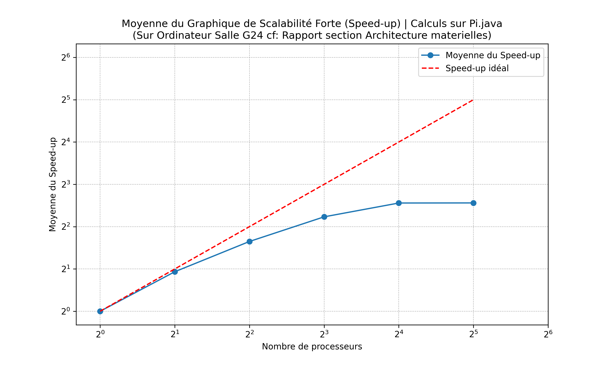

  - **Pi.java Sur l'environnement personnel (MSI VECTOR)** :
    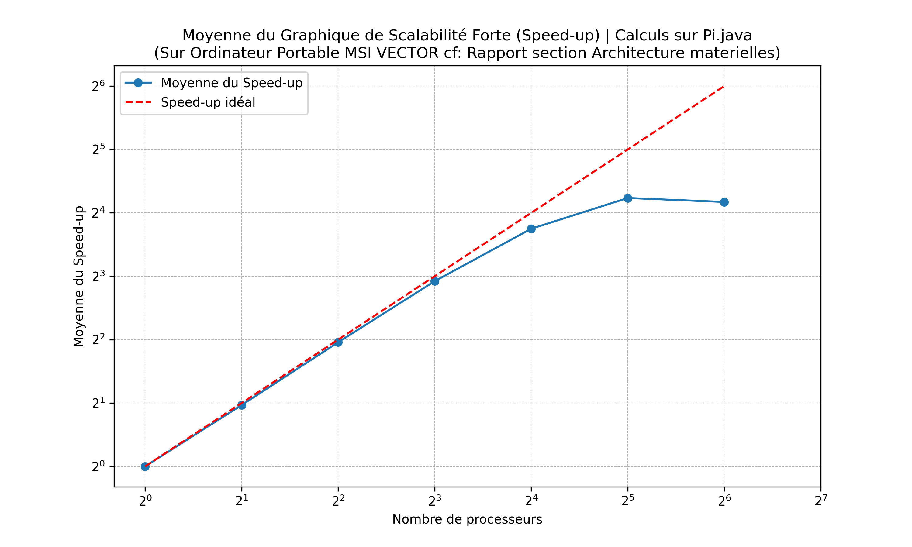

  - **Assignment102.java Sur l'environnement en G24** :
    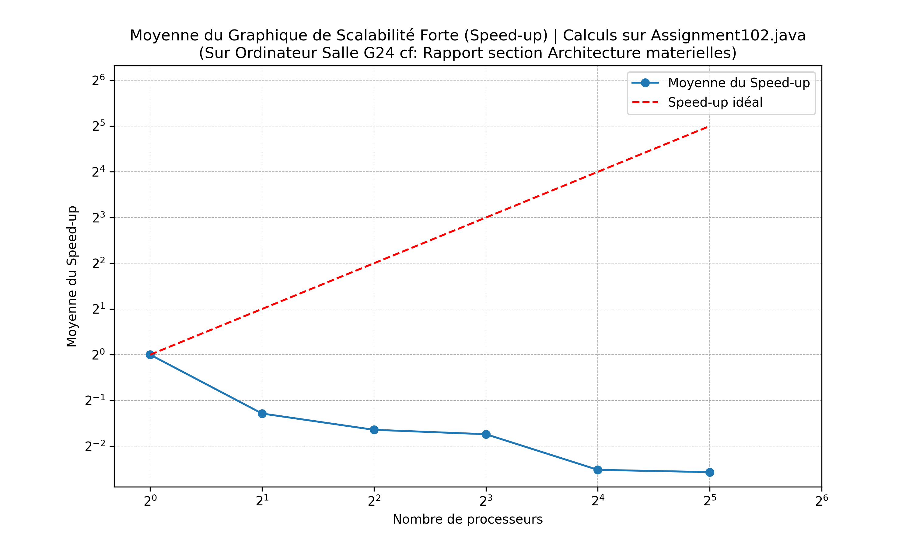
    
  - **Assignment102.java Sur l'environnement personnel (MSI VECTOR)** :
    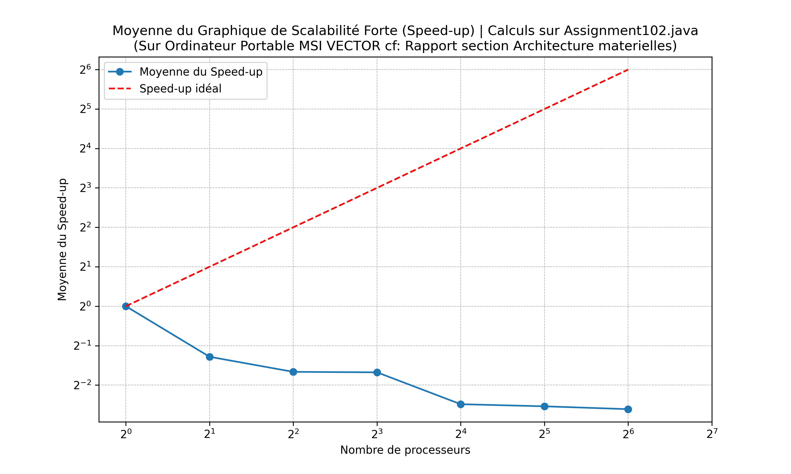
  
- **Graphiques de Scalabilité Faible respectivement de Pi.java et Assignment102.java** :

  - **Pi.java Sur l'environnement en G24** :
    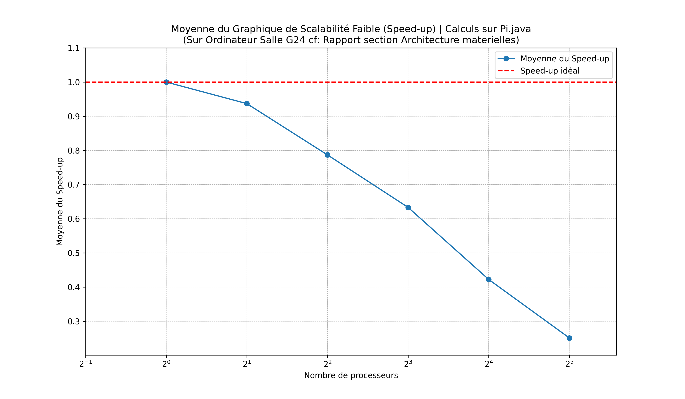

  - **Pi.java Sur l'environnement personnel (MSI VECTOR)** :
    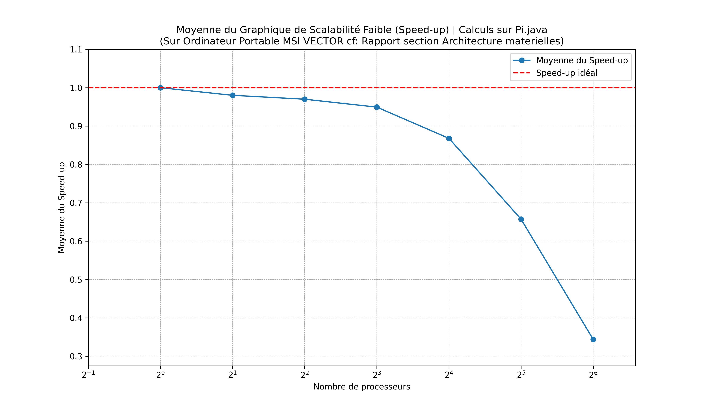

  - **Assignment102.java Sur l'environnement en G24** :
    
    
  - **Assignment102.java Sur l'environnement personnel (MSI VECTOR)** :
    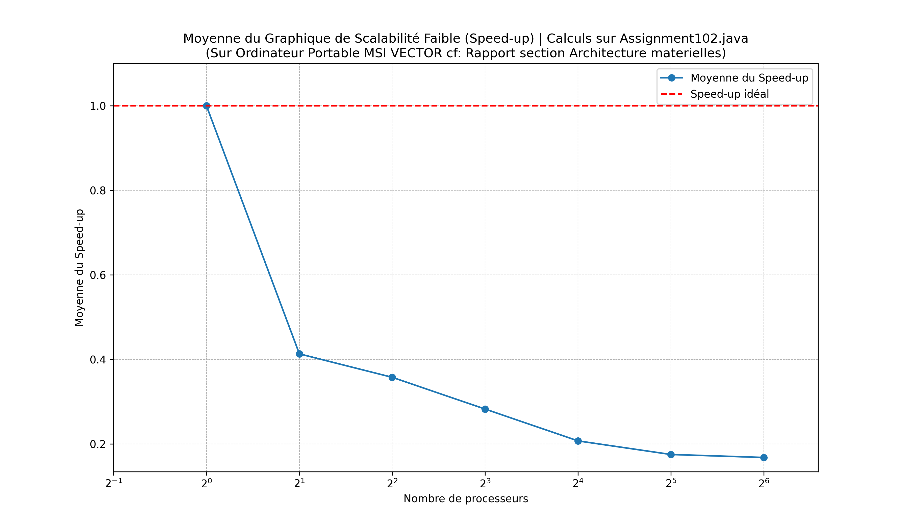

- **Assignment102** :
  - La scalabilité est limitée par le compteur partagé $(n_{\text{cible}})$, qui devient un goulot d’étranglement.
  - Le speedup est moins linéaire en raison des conflits liés à la synchronisation.

- **Pi.java** :
  - Grâce au modèle Master-Worker, les Workers fonctionnent indépendamment. Cela réduit les conflits et améliore les performances, notamment pour les charges de travail importantes.

<br>


### **4.6. Rapport avec la norme Iso**

#### Calcul du Time et du Task Time

Pour évaluer l'efficacité du parallélisme dans nos calculs, nous utilisons deux méthodes principales pour déterminer le temps cible (Tt) et le temps mesuré (Ta) :

1. **Comparaison avec un code séquentiel**
    - **Temps cible (Tt)** : Correspond au temps d’exécution sur un seul processeur, soit T1.
    - **Temps mesuré (Ta)** : Temps d’exécution parallèle avec p processeurs, soit Tp.
   
   Cette méthode évalue l’amélioration due au parallélisme en comparant les performances parallèles à celles d'une exécution séquentielle.

2. **Parallélisme idéal (choix retenu)**
    - **Temps cible (Tt)** : Défini comme le temps idéal, soit Tp, dans l'hypothèse d'un parallélisme parfait.
    - **Temps mesuré (Ta)** : Temps réellement mesuré avec p processeurs, également noté Tp.

   Ce cadre est utilisé pour mesurer la proximité des performances réelles par rapport à un parallélisme idéal.

#### Calcul de l’efficacité selon la norme ISO/IEC 25022:2012

L’efficacité est calculée en suivant la formule :
- **Efficacité = (Tt / Ta) * 100**
  - **Tt** : Temps idéal parallèle.
  - **Ta** : Temps d’exécution réel.

Une efficacité élevée indique une proximité avec le parallélisme idéal, signifiant que le programme est plus efficace.

Une autre formule possible est :
- **Efficacité = (Tt - Ta) / Tt**
  - Avec **Tt = (1/p) * T1** pour un parallélisme idéal.

Cette mesure évalue l'efficacité du programme en pourcentage : plus ce pourcentage est élevé, mieux c'est.

Le **Time**, quant à lui, est défini par :
- **Time = TT / Ta**
  - Ce qui équivaut au speedup, comparant le code séquentiel au temps parallèle.

### Efficacité selon la norme ISO/IEC 25022:2012

Nous utilisons la métrique de l'erreur pour évaluer l'efficacité de notre code de Monte Carlo en calculant l'écart entre la valeur calculée de π et la valeur réelle :

- **Erreur = Math.abs((value - Math.PI)) / Math.PI**
  - **value** : Valeur de π estimée par le code de Monte Carlo.
  - **Math.PI** : Valeur réelle de π.

L'objectif est de voir comment l'erreur diminue avec l'augmentation du nombre d'itérations, ce qui indique une meilleure approximation de π. Plus le nombre d'itérations est élevé, plus la précision de l'estimation devrait s'améliorer.

Cette métrique nous permet également de juger la fiabilité du code dans les contextes de scalabilité réduite, où la diversité des points testés est plus grande, offrant une mesure complète de la satisfaction de la qualité d'utilisation (trust) des algorithmes.

### **4.7. Effectiveness sur Pi.java**

- 1. **Définition de l'Effectiveness** :
   L'effectiveness est calculée comme le rapport entre le speed-up réel obtenu et le speed-up idéal pour le même nombre de processeurs. Elle est exprimée en pourcentage. Formule : $[\text{Effectiveness (\%)} = \left(\frac{\text{Speed-up réel}}{\text{Speed-up idéal}}\right) \times 100 ]$

- 2. **Ajout de la colonne au tableau** :
   Pour chaque valeur du nombre de processeurs, nous calculerons l'effectiveness en utilisant les données du speed-up réel extraites du graphique et le speed-up idéal (qui serait le même que le nombre de processeurs, car le speed-up idéal double à chaque fois que le nombre de processeurs double).

#### Scalabilité forte (Pi) sur machine personnelle (MSI VECTOR) :

|   AvailableProcessors |      PI |   Difference |     Error |    Ntot |   TimeDuration(ms) |  Moyenne du Speed-up Réel | Speed-up Idéal | Effectiveness (%) |
|----------------------:|--------:|-------------:|----------:|--------:|-------------------:|-------------------------:|---------------:|------------------:|
|                     1 | 3.14092 |   -0.000669  | 0.0003744 | 1.6e+06 |               49.7 |                       1.0 |              1 |       100         |
|                     2 | 3.14122 |   -0.0003752 | 0.0002657 | 1.6e+06 |               34.8 |                       1.43|              2 |       71.5        |
|                     4 | 3.14193 |    0.000341  | 0.0003862 | 1.6e+06 |               27.5 |                       1.81|              4 |       45.25       |
|                     8 | 3.14123 |   -0.0003585 | 0.0003411 | 1.6e+06 |               40.6 |                       1.22|              8 |       15.25       |
|                    16 | 3.14137 |   -0.0002272 | 0.0004115 | 1.6e+06 |               58.2 |                       0.85|             16 |        5.31       |
|                    32 | 3.14128 |   -0.0003174 | 0.000346  | 1.6e+06 |               86.4 |                       0.57|             32 |        1.78       |
|                    64 | 3.14198 |    0.0003916 | 0.0002352 | 1.6e+06 |               94.1 |                       0.53|             64 |        0.83       |

Notez que la colonne "Moyenne du Speed-up Réel" est calculée en fonction de la durée réelle obtenue et de la durée pour un processeur, et que le speed-up idéal est calculé en supposant que chaque doublement du nombre de processeurs double la vitesse d'exécution.

Cette colonne "Effectiveness" montre de manière claire à quel point le speed-up réel s'éloigne de l'idéal à mesure que le nombre de processeurs augmente, et aide à identifier des problèmes de scalabilité ou de parallélisme non efficace.

### **4.7bis. Analyse Comparée des Speed-Ups**


#### **Graphique avec $( N_{tot} = 1.6 )$ milliard de points**

  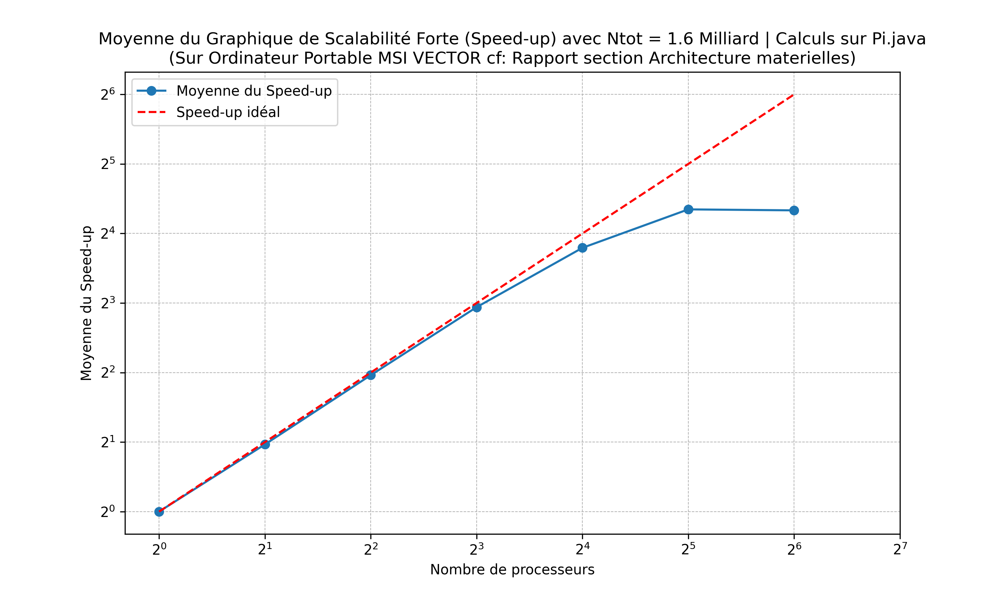

- L'augmentation du speed-up suit la tendance idéale jusqu'à $( 2^3 )$ processeurs, après quoi elle décline, indiquant une diminution des gains d'efficacité avec un nombre accru de processeurs.
- Cette configuration montre des gains de performances initiaux qui sont meilleurs comparés aux autres configurations avec moins de points.

#### **Graphique avec $( N_{tot} = 160 )$ millions de points**
- Le speed-up augmente régulièrement jusqu'à $( 2^3 )$ processeurs, puis plafonne et diminue légèrement à $( 2^5 )$.
- Le speed-up idéal est linéaire, indiquant que le système devrait théoriquement continuer à améliorer ses performances avec l'ajout de processeurs.

  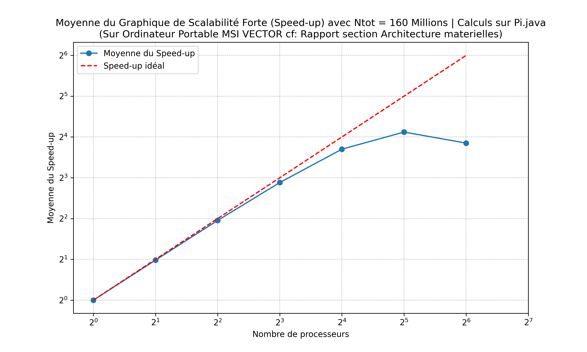

#### **Graphique avec $( N_{tot} = 16 )$ millions de points**
- Le speed-up maximal est atteint à $( 2^3 )$ processeurs puis diminue, similaire au graphique avec 160 millions de points, mais avec un plafonnement plus marqué.
- La performance relative est plus faible par rapport aux ensembles de données plus grands, indiquant que moins de données pourraient ne pas utiliser efficacement un grand nombre de processeurs.

  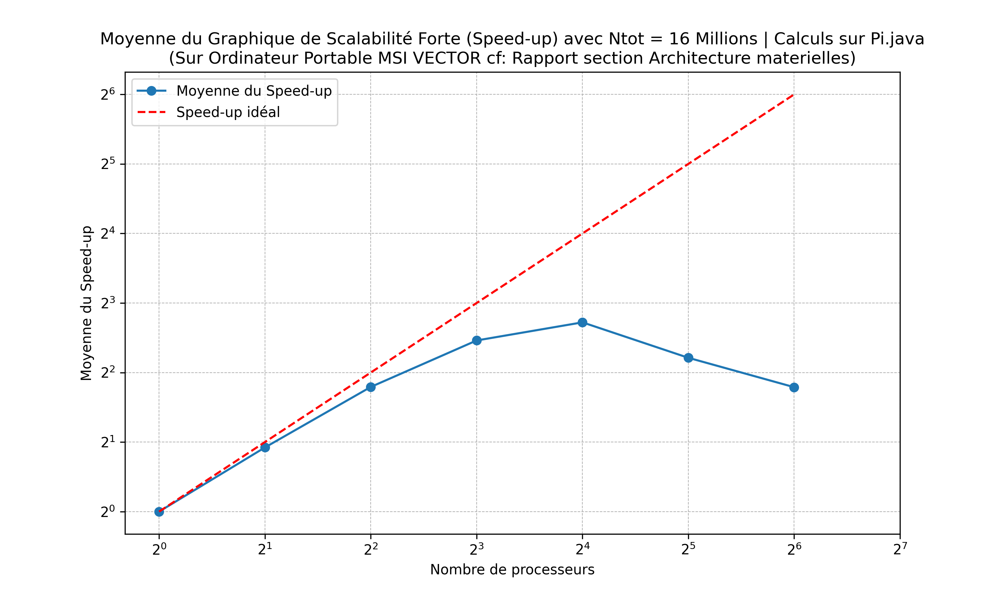

#### **Graphique avec $( N_{tot} = 1.6 )$ million de points**
- La performance semble s'améliorer légèrement jusqu'à $( 2^2 )$ processeurs, mais diminue nettement à $( 2^4 )$ et $( 2^5 )$.
- Ceci suggère que pour de très petits ensembles de données, l'ajout de processeurs peut en fait réduire l'efficacité due à l'overhead de gestion du parallélisme.

  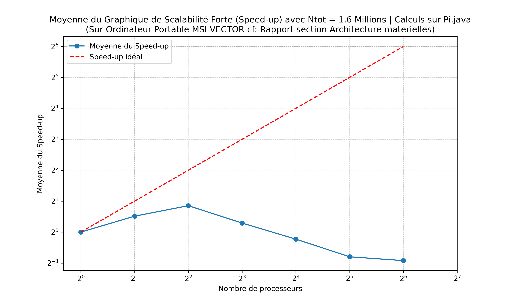

### Observations Générales

- **Impact de la Taille des Données** : Les ensembles de données plus importants semblent bénéficier d'une augmentation du nombre de processeurs jusqu'à un certain point, après quoi l'efficacité diminue. Cela pourrait être dû à l'overhead de communication et de synchronisation qui devient plus prononcé avec de grands nombres de processeurs.
- **Optimalité des Ressources** : Les processeurs sont mieux utilisés quand il y a suffisamment de données à traiter. Pour les petits ensembles de données, augmenter le nombre de processeurs au-delà d'un certain seuil ne produit pas d'amélioration significative de la performance, voire entraîne une dégradation.
- **Comparaison avec le Speed-Up Idéal** : Aucune configuration n'atteint le speed-up idéal, indiquant des pertes dues à des inefficacités dans la gestion du parallélisme, probablement à cause des coûts de communication inter-processus et de l'équilibrage de charge.

## 5. Mise en œuvre de Monte Carlo en mémoire distribuée <a id="mise-en-oeuvre-en-memoire-distribuee"></a>

### **5.1. Architecture distribuée**

L’approche distribuée repose sur le modèle **Master-Worker**, où :

1. **MasterSocket** :  
   - Coordonne les tâches.
   - Envoie les instructions aux **Workers** via des sockets.
   - Agrège les résultats partiels pour obtenir $( \pi )$.

2. **WorkerSocket** :  
   - Reçoit les instructions du Master.
   - Effectue une partie du calcul Monte Carlo.
   - Retourne les résultats au Master.

3. **Communication via Sockets** :  
   - Les échanges sont réalisés avec des flux (BufferedReader et PrintWriter) pour assurer une communication fiable entre le Master et les Workers.

<br>

### **5.2. Paradigme utilisé**

Le système combine deux niveaux de parallélisation :
- **Programmation distribuée** : Le calcul est réparti sur plusieurs machines via des sockets.
- **Programmation parallèle locale** : Chaque Worker exécute ses calculs en parallèle sur ses propres cœurs.

<br>

### **5.3. Comparaison avec les implémentations précédentes**

| Critère               | Mémoire partagée             | Mémoire distribuée         |
|-----------------------|------------------------------|----------------------------|
| **Facilité d'implémentation** | Simplicité relative.       | Complexité accrue (communication). |
| **Performance**       | Limité par les conflits de synchronisation. | Évolutif (scalabilité horizontale). |
| **Utilisation des ressources** | Uniquement sur une machine. | Exploite plusieurs machines. |

<br>

### **5.4. Illustration de l'architecture**

#### Diagrammes
- **Schéma de Monte Carlo Distribué** :  
  

- **Diagramme des tâches (Master-Worker)** :  
  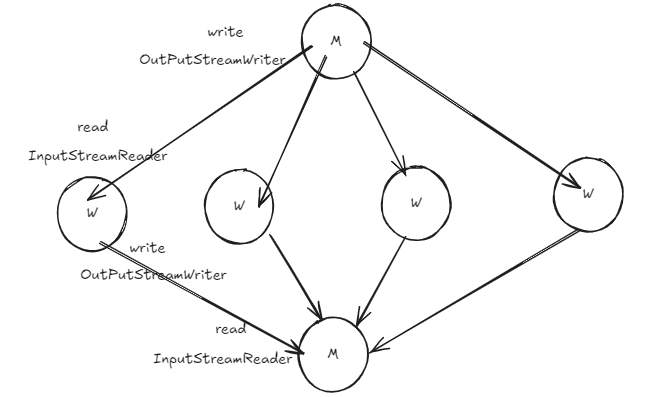

<br>

### **5.5. Observations** :

- **Graphiques de Scalabilité Forte et Faible respectivement dans un environnement local sur une seule Machine** :

  - **MasterWorker Scalabilité Forte sur l'environnement personnel (MSI VECTOR)** :
  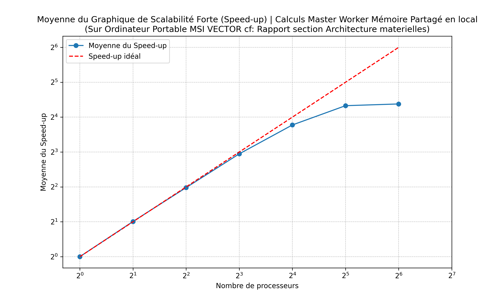

  - **MasterWorker Scalabilité Faible sur l'environnement personnel (MSI VECTOR)** :
  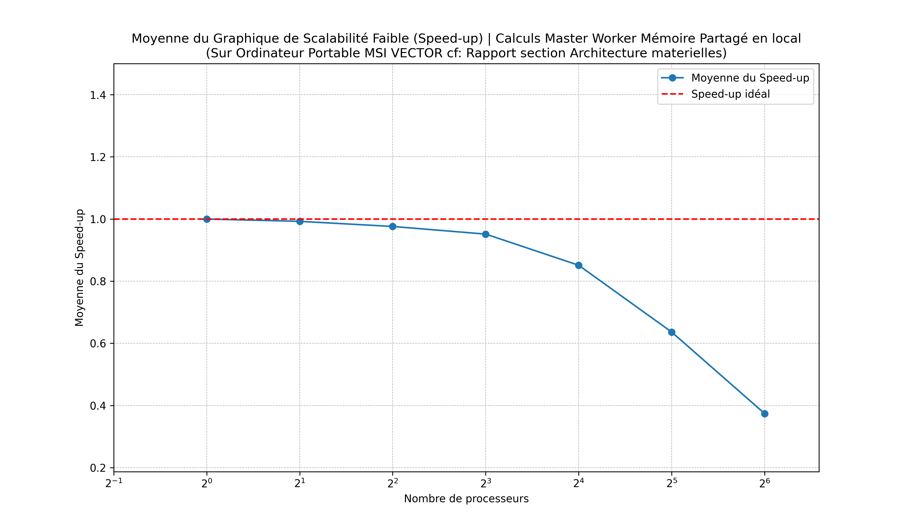

<br>

## 6. Analyse de performance sur Master Worker en local <a id="analyse-master-workers-en-local"></a>

Le calcul de Pi à l'aide de la méthode Monte Carlo a été mis en œuvre dans un environnement **distribué** en exploitant un cluster de machines fonctionnant sous **CentOS 9**. L'objectif était de répartir les calculs sur plusieurs machines interconnectées via un réseau, tout en assurant une communication efficace grâce à des sockets TCP.

<br>

### **6.1. Analyse des Performances du Master Worker en Mémoire Partagée Locale**

Nous allons examiner les performances du Master Worker en mémoire partagée locale sur un ordinateur portable personnel, à l'aide des graphiques de scalabilité forte et faible.

#### Scalabilité Forte


**Observations** :
- La courbe montre que le speed-up se rapproche d'une croissance linéaire jusqu'à un certain nombre de processeurs, mais plafonne ensuite.
- Le speed-up idéal, représenté par la ligne rouge pointillée, indique une augmentation proportionnelle du speed-up avec le nombre de processeurs. Cependant, le speed-up réel commence à s'aplatir après 16 processeurs.
- Cette tendance pourrait indiquer que bien que le système puisse efficacement distribuer le travail entre plusieurs cœurs, il y a des limites liées à la coordination et la communication entre les threads, mais également ont peut souligner la limitation du matériel étant selon la section architecture materielle du rapport, la configuration du MSI Vector est de 24 coeurs physiques et 32 coeurs logique.

#### Scalabilité Faible


**Observations** :
- Le speed-up dans le cas de scalabilité faible montre une décroissance significative à mesure que le nombre de processeurs augmente.
- Idéalement, le speed-up devrait rester constant puisque la charge de travail augmente proportionnellement au nombre de processeurs. Cependant, le graphique montre une efficacité réduite, surtout après 8 processeurs.
- Cette performance pourrait être attribuée à une augmentation de la complexité de la gestion des données à travers les différents processeurs, entraînant une surcharge plus élevée pour la synchronisation et la communication.

<br>

### **6.2. Synthèse des Résultats**

Les résultats indiquent que le Master Worker, lorsqu'il est exécuté en environnement de mémoire partagée locale, peut efficacement tirer parti de plusieurs cœurs jusqu'à un certain point, après quoi les gains de performance se stabilisent ou régressent. Ces observations suggèrent que des optimisations supplémentaires pourraient être nécessaires pour gérer la synchronisation des threads et l'accès concurrent à la mémoire, particulièrement dans des environnements avec un grand nombre de processeurs.

<br>

## 7. Parallélisation sur plusieurs machines <a id="analyse-master-workers-en-local"></a>

### **7.1. Configuration et préparation des machines**

#### 1. Installation des dépendances
Avant de déployer le programme, chaque machine (master et workers) a été configurée pour exécuter du code Java. Cela inclut l'installation des outils de développement nécessaires :
```bash
sudo yum install java-devel
```

#### 2. Configuration du réseau
Chaque machine a été assignée une **adresse IP unique** et un **port TCP dédié** pour assurer des communications fiables entre le master et les workers. Par exemple :
- Le **worker 1** écoute sur `192.168.24.154:25545`.
- Le **worker 2** écoute sur `192.168.24.150:25546`.

Pour autoriser les connexions entrantes, nous avons ouvert les ports spécifiques via le pare-feu :
```bash
firewall-cmd --zone=public --add-port=25545/tcp
firewall-cmd --zone=public --add-port=25546/tcp
```

#### 3. Gestion des adresses et ports dans le code
Les adresses IP et les ports des machines sont codés dans un tableau, permettant au master de se connecter dynamiquement à chaque worker :
```java
static final String[] tab_ips = {
    "192.168.24.154", "192.168.24.150", "192.168.0.103", "192.168.0.104"
};
static final int[] tab_ports = {25545, 25546, 25547, 25548};
```

Pour établir la connexion, le master utilise la méthode suivante :
```java
sockets[i] = new Socket(tab_ips[i], tab_ports[i]);
```

<br>

### **7.2. Compilation et déploiement**

#### Déploiement des fichiers Java
Le code Java pour le master et les workers a été déployé sur leurs machines respectives à l'aide de **rsync** ou **scp**. Une fois transféré, le programme a été compilé localement sur chaque machine :
```bash
javac racineprojet/bin/ racineprojet/src/*.java
```

#### Lancement des workers
Chaque machine worker est configurée pour écouter sur son port attribué, prête à recevoir des requêtes du master. Par exemple :
```bash
java racineprojet/src/WorkerSocket 25545
```

<br>

### **7.3. Exécution et coordination**

#### Étape 1 : Lancement du master
Une fois les workers démarrés, le master est lancé. Il établit une connexion avec chaque worker en utilisant leurs adresses IP et ports. Ensuite, il envoie des requêtes pour effectuer les calculs Monte Carlo.

#### Étape 2 : Calcul distribué
Chaque worker reçoit une portion des calculs à effectuer (nombre de points Monte Carlo). Les résultats partiels sont envoyés au master dès qu'ils sont prêts.

#### Étape 3 : Agrégation et sauvegarde des résultats
Le master collecte les résultats de tous les workers, les combine pour calculer $( \pi )$, et affiche les informations suivantes :
- La valeur estimée de $( \pi )$,
- L'erreur relative,
- Le nombre total de points traités,
- Le temps d'exécution.

Les résultats sont également sauvegardés dans un fichier CSV :
```java
saveResultsToCsv("results.csv", pi, difference, error, ntot, numWorkers, timeDuration);
```

Exemple d'entrée dans le fichier CSV :
```csv
PI,Difference,Error,Ntot,AvailableProcessors,TimeDuration(ms)
3.141592,0.000001,0.000032,160000000,16,2350
```

<br>

### **7.4. Optimisation : Multiplication des workers**

Un avantage majeur de cette approche est la possibilité d'exploiter **tous les cœurs logiques** de chaque machine. Par exemple, si une machine dispose de **8 cœurs**, elle peut exécuter plusieurs instances de WorkerSocket pour maximiser les calculs parallèles localement. Cela permet de multiplier les workers sur une seule machine, augmentant ainsi la capacité de traitement tout en limitant le nombre de machines nécessaires.

<br>

### **7.5 Analyse des performances du Master Worker distribué**

#### Scalabilité Forte et Faible sur l'environnement G24

Pour évaluer l'efficacité du modèle Master Worker en environnement distribué, nous examinerons les résultats de scalabilité forte et faible obtenus dans la salle G24.

#### 1. Scalabilité Forte (Master Worker Distribué)
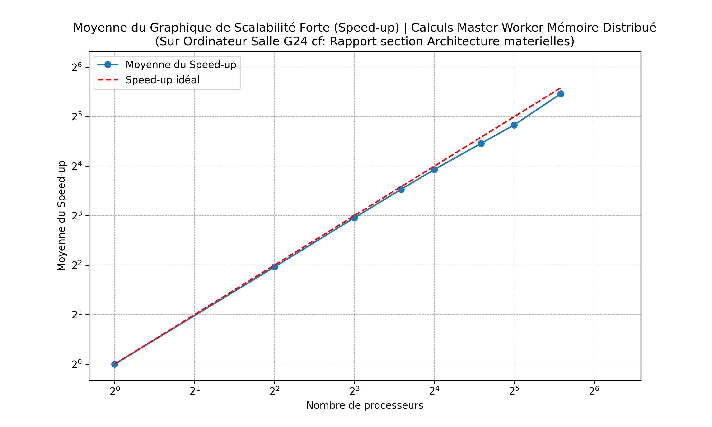

**Observations**:
- Le graphique montre le speed-up (accélération du temps d'exécution) en fonction de l'augmentation du nombre de processeurs.
- Idéalement, le speed-up devrait augmenter de manière linéaire avec le nombre de processeurs, mais des déviations peuvent survenir en raison de l'overhead de communication et de synchronisation.
- Cette courbe permettra d'évaluer si l'ajout de processeurs améliore proportionnellement les performances ou si des facteurs limitatifs entrent en jeu.

#### 2. Scalabilité Faible (Master Worker Distribué)
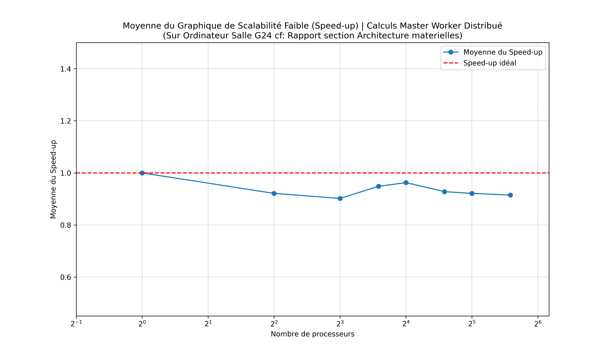

**Observations**:
- La scalabilité faible mesure le speed-up tout en augmentant proportionnellement la charge de travail avec le nombre de processeurs.
- Un speed-up constant ou légèrement croissant serait idéal, indiquant que le système gère efficacement des charges de travail plus grandes sans perte significative d'efficacité.
- Ce graphique aide à comprendre si le système est capable de maintenir sa performance malgré l'augmentation de la charge, un indicateur clé de l'évolutivité du système.

### Conclusion de l'Analyse

- **Efficacité du Parallélisme**: L'analyse des graphiques fournira des insights sur l'efficacité du parallélisme dans le cadre du Master Worker distribué, notamment en ce qui concerne l'impact de l'overhead de la gestion de la communication réseau et de la synchronisation des tâches.
- **Optimisation Possible**: Selon les résultats, des recommandations d'optimisation pourraient être nécessaires, par exemple en améliorant les algorithmes de répartition des tâches ou en minimisant la communication interprocessus pour réduire l'overhead.

<br>

### **7.6. Avantages de cette architecture**

- **Scalabilité horizontale :** L'ajout de nouvelles machines dans le cluster permet de traiter un plus grand nombre de points Monte Carlo en parallèle.
- **Répartition efficace :** Chaque machine effectue une partie distincte du calcul, ce qui réduit les risques de surcharge.
- **Modularité :** La séparation entre le master et les workers permet d'adapter facilement le système à différentes configurations réseau.
- **Optimisation locale :** Exploitation maximale des cœurs logiques sur chaque machine grâce à l'exécution parallèle de plusieurs workers.

<br>

### **7.7. Illustration du fonctionnement**

#### Diagramme de l'architecture distribuée
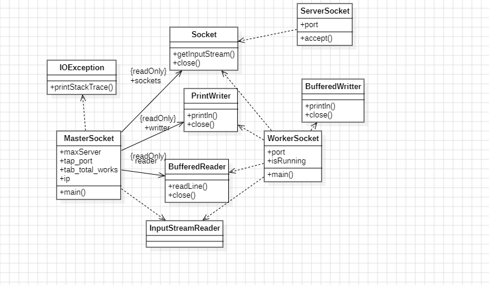

#### Diagramme des tâches (Master-Worker)


<br>

## 8. Erreurs sur le nombre Pi par scripts et itérations

L'analyse des erreurs dans l'estimation de Pi en fonction du nombre d'itérations joue un rôle crucial pour comprendre la précision et l'efficacité des scripts utilisés dans nos expérimentations. Le graphique ci-dessous illustre la performance de trois algorithmes distincts - Assignment, Pi Calculation, et Master Worker Partagé - en mesurant les erreurs par rapport au nombre total d'itérations.

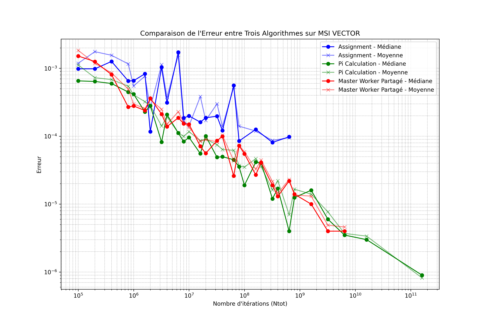

### **8.1. Interprétation des Résultats**

- **Axes**:
  - **Axe horizontal (Logarithmique)** : Nombre d'itérations total (`Ntot`), indiquant l'ampleur des calculs effectués.
  - **Axe vertical (Logarithmique)** : Erreur, mesurant l'écart entre la valeur estimée de π et sa valeur réelle approximative (π ≈ 3.14159).

- **Couleurs et Marqueurs**:
  - **Bleu (Cercle et Étoile)** : Résultats pour l'algorithme 'Assignment', avec des points pour la médiane et des étoiles pour la moyenne.
  - **Vert (Triangle et Losange)** : Résultats pour 'Pi Calculation', suivant le même schéma de marquage.
  - **Rouge (Croix et X)** : Résultats pour 'Master Worker Partagé', illustrant également la médiane et la moyenne.

<br>

#### **8.2. Observations Clés**

1. **Tendance Générale**:
   - Pour tous les algorithmes, l'erreur tend à diminuer avec l'augmentation du nombre d'itérations, ce qui est conforme aux attentes théoriques de la loi des grands nombres appliquée à la méthode de Monte Carlo.

2. **Comparaison entre les Algorithmes**:
   - **Assignment** et **Pi Calculation** montrent des performances similaires, avec des fluctuations notables dans l'erreur médiane et moyenne, surtout dans les gammes d'itérations moyennes (10^7 à 10^9).
   - **Master Worker Partagé** montre une réduction plus cohérente et stable de l'erreur avec l'augmentation des itérations, suggérant une possible meilleure gestion de la variance dans l'estimation de π, peut-être due à une meilleure répartition du travail et synchronisation.

3. **Implications Pratiques**:
   - La diminution de l'erreur avec des itérations plus élevées confirme l'importance d'un nombre suffisant d'essais pour atteindre une précision acceptable dans l'estimation de π.
   - Les performances relatives des scripts indiquent que le choix de l'algorithme et sa mise en œuvre peuvent significativement influencer la précision des résultats, soulignant l'importance d'optimisations algorithmiques et de choix de conception.

<br>

## 9. Conclusion

L'approche distribuée implémentée dans ce projet démontre une utilisation efficace des ressources réseau et matérielles pour effectuer des calculs Monte Carlo sur un cluster de machines. Grâce à l'architecture **Master-Worker** et à l'utilisation des sockets TCP, ce système est capable de traiter des charges importantes tout en restant flexible et évolutif.

> **Liens de Navigation**
>
> [Retour en haut](#debut)