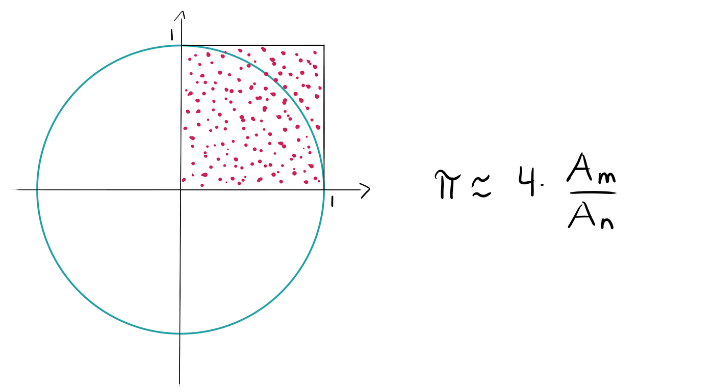

### Université de Versailles Saint-Quentin-en-Yvelines

### **IUT DE VELIZY, Département Informatique**

**Auteur :** `Lucas DA SILVA FERREIRA`  
**Classe :** `INFO3 - FI`  
**Date :** `11 Décembre 2024`

Note Importante : Ce rapport à été reformulé plus clairement à l'aide de ChatGPT et à été **<u>relu minutieusement</u>** en connaissance de cause d'une bonne transmission et d'une bonne expression de ce que j'ai appris lors de ce cours et de prévenir tout phénomène d'hallucination éventuel de la part de ce modèle.

# **Compte Rendu 2  - Développement Avancé**

<br>

## Sommaire

- [0. Introduction](#introduction)
- [0bis. Architecture matérielle](#architecture-materielle)
- [1. Méthode MC](#methode-mc)
- [2. Algorithmes et Paradigmes employés](#algo-et-paradigme)
  - [2.1. Iteration](#iteration)
  - [2.2. MasterWorker](#masterworker)
- [3. Mise en oeuvre sur Machine Partagé](#mise-en-oeuvre-sur-machine-partage)
  - [3.1. Analyse Assignment 102](#analyse-assignment-102)
  - [3.2. Analyse Pi.java](#analyse-pijava)
- [4. Qualité de test de perf](#qualite-de-test-de-perf)
- [5. Mise en oeuvre en mémoire distribuée](#mise-en-oeuvre-en-memoire-distribuee)
  - [5.1. Java Socket MW](#java-socket-mw)
- [6. Perf MW](#perf-mw)
- [7. Parallélisation sur plusieurs machines](#parallelisation-sur-plusieurs-machines)
- [9. Conclusion](#conclusion)

---

<br>

## 0. Introduction <a id="introduction"></a>

Ce rapport présente une exploration approfondie des techniques de calcul parallélisé pour résoudre le problème de l'approximation de la valeur de π à l'aide de la méthode Monte Carlo. Cette méthode statistique repose sur l'utilisation de points aléatoires pour évaluer la surface d'un cercle inscrit dans un carré.

Afin d'optimiser ce calcul, plusieurs paradigmes et approches ont été implémentés, incluant l'utilisation de multithreading, la distribution de calculs sur plusieurs machines, et l'exploitation de sockets pour coordonner les travailleurs distants. Les codes sources étudiés, tels que Pi.java, MasterSocket.java, Assignment102.java, et CsvWriter.java, illustrent ces différents aspects du développement avancé.

Nous avons structuré ce rapport pour suivre une progression logique : nous commencerons par décrire la méthode Monte Carlo (section 1) et les algorithmes employés (section 2). Nous examinerons ensuite la mise en œuvre de ces algorithmes sur des machines partagées, ainsi que leur adaptation pour des environnements distribués (sections 3 et 5). Enfin, nous évaluerons les performances obtenues grâce aux tests et à la parallélisation sur plusieurs machines (sections 4, 6 et 7).

Chaque section met en lumière un aspect technique clé, depuis les principes algorithmiques jusqu'à l’analyse des performances. Les résultats, sauvegardés sous forme de fichiers CSV, offrent une traçabilité pour valider l’efficacité des solutions développées. Ce travail s'inscrit dans une démarche pédagogique visant à maîtriser les concepts avancés de développement logiciel, tout en explorant leur mise en œuvre concrète sur des architectures modernes.

<br>

## 0bis. Architecture Matérielle <a id="architecture-materielle"></a> 

|            | G25                                                         | I21                                                         | G24                                                         | OnePlus 9                                                   |
|------------|--------------------------------------------------------------|--------------------------------------------------------------|--------------------------------------------------------------|--------------------------------------------------------------|
| **CPU**    | i7 4790, 4c/8t, 3.6GHz, 4.0GHz Turbo, 64-bit                 | i7 4790, 4c/8t, 3.6GHz, 4.0GHz Turbo, 64-bit                 | i7-12700T, 12c/20t (8p-core, 4e-core), 1.4GHz - 4.7GHz Turbo, 64-bit | i9-14900HX, 24c/32t (8p-core, 16e-core), 2.2Hz - 5.8GHz Turbo, 64-bit |
| **RAM**    | 8Go RAM Micron MT16KTF1G64AZ-1G6E1 DDR3 PC3L-12800U 2Rx8 1600MHz 1.35v CL11 | 2x8Go RAM Micron MT16KTF1G64AZ-1G6E1 DDR3 PC3L-12800U 2Rx8 1600MHz 1.35v CL11 | 2x32Go RAM Micron MTC16G2085S1SC-48BA1 SODIMM-DDR5 PC5-38400 2Rx8 4800MHz 1.1v CL40 |  |
| **GPU**    | eGPU Intel, Intel® HD Graphics 4600, Mémoire vidéo maxi du sous-ensemble graphique 2Go RAM for VRAM | eGPU Intel, Intel® HD Graphics 4600, Mémoire vidéo maxi du sous-ensemble graphique 2Go RAM for VRAM | eGPU Intel, Intel® HD Graphics 770, 32 cores, 300MHz - 1.5GHz Turbo | NVIDIA RTX 4090, 10492 cuda core, 700Mhz - 2.3Ghz Turbo, 16 Go VRAM 8Ghz |
| **Disque** | LITEONIT LCS-256L9S-11 256Go, 2.5", 7mm SATA 6Gb/s           | LITEONIT LCS-256L9S-11 256Go, 2.5", 7mm SATA 6Gb/s           | SOLIDIGM SSDPFKNU512GZ 512Go M.2 NVMe PCIe                   | 256Go UFS 3.0                                               |
| **Type de disque** | SSD                                                  | SSD                                                          | SSD                                                          | SSD                                                          |
| **Fichier de pagination** | Oui                                           | Oui                                                          | Oui                                                          | Non                                                          |
| **Fichier d’échange** | Oui                                               | Oui                                                          | Oui                                                          | Non                                                          |

TODO (ECRIRE UN PARAGRAPHE DU MATERIEL EMPLOYEE POUR LE TP)

- **Msconfig** : un utilitaire Windows qui permet de visualiser et configurer le démarrage et certains aspects de la configuration matérielle.
- **Gestionnaire de tâches** : utile pour vérifier l'utilisation des ressources en temps réel, notamment l'usage du processeur, de la mémoire et du disque.
- **Commandes CMD** : Windows offre plusieurs commandes en ligne permettant d'obtenir des informations spécifiques sur le matériel. Par exemple, la commande `wmic memorychip get serialnumber` permet de récupérer le numéro de série de la mémoire vive (RAM), offrant ainsi plus de détails sur sa configuration.

<br>

## 1. Méthode MC <a id="methode-mc"></a>

La méthode Monte Carlo est une technique probabiliste permettant d'estimer la valeur de π. Elle repose sur des simulations aléatoires de points dans un carré de côté $( r = 1 )$, et sur l'observation de la proportion de ces points qui tombent dans un quart de disque inscrit.

### Principe mathématique :

1. **Aire d'un quart de disque** :  
   Pour un cercle de rayon $( r = 1 )$, l'aire d'un quart de disque est donnée par :  
   $$
   A_{\text{quart}} = \frac{\pi \cdot r^2}{4} = \frac{\pi}{4}
   $$

2. **Aire du carré** :  
   Pour un carré de côté $( r = 1 )$, l'aire est :  
   $$
   A_{\text{carré}} = r^2 = 1
   $$

3. **Probabilité d'un point dans le quart de disque** :  
   La probabilité qu'un point $( X_p(x_p, y_p) )$ tiré uniformément dans $( ]0, 1[ \times ]0, 1[ )$ appartienne au quart de disque est :  
   $$
   P = \frac{A_{\text{quart}}}{A_{\text{carré}}} = \frac{\pi}{4}
   $$

4. **Estimation de π par simulation** :  
   En effectuant $( n_{\text{tot}} )$ tirages aléatoires, et en comptant $( n_{\text{cible}} )$, le nombre de points qui tombent dans le quart de disque $( x_p^2 + y_p^2 \leq 1 )$, la proportion $( P )$ peut être estimée par :  
   $$
   P \approx \frac{n_{\text{cible}}}{n_{\text{tot}}} \approx \frac{\pi}{4}
   $$

   D'où :  
   $$
   \pi \approx 4 \cdot \frac{n_{\text{cible}}}{n_{\text{tot}}}
   $$

<br>

- Illustration :


Source : <a href="https://www.cantorsparadise.org/estimating-p-using-monte-carlo-simulations-3459a84b5ef9/">Estimating π with Monte-Carlo-Simulations, Rediger par Maike Elisa, publié sur Cantors Paradise le 22 Fevrier 2020</a>

<br>

## 2. Algorithmes et Parallélisation <a id="algo-et-paradigme"></a>

La parallélisation des calculs Monte Carlo repose sur deux paradigmes principaux : les itérations indépendantes et le modèle Master-Worker.

### Dépendances entre tâches

Le calcul de π à l'aide de la méthode Monte Carlo peut être décomposé en plusieurs sous-tâches organisées avec des dépendances précises :

1. **Tâche principale (T0)** : Tirer et compter les points $(n_{\text{tot}})$.
   - **Sous-tâche T0p** : Tirer un point aléatoire $(X_p(x_p, y_p))$ dans le carré.
     - **T0p1** : Générer $(x_p)$ et $(y_p)$.
     - **T0p2** : Vérifier si le point appartient au quart de cercle et incrémenter $(n_{\text{cible}})$.

2. **Tâche secondaire (T1)** : Calculer la valeur de π après avoir terminé $(T0)$.

### Organisation des dépendances

- **Dépendances directes** :
  - $(T1)$ dépend de $(T0)$ pour le calcul final.
  - $(T0p2)$ dépend de $(T0p1)$ pour obtenir les coordonnées du point.

- **Indépendance des instances** :
  - Les instances de $(T0p1)$ sont indépendantes les unes des autres.
  - Les instances de $(T0p2)$ sont également indépendantes entre elles.

Cette organisation garantit une exécution parallèle efficace, surtout pour $(T0p1)$ et $(T0p2)$, où chaque itération peut être exécutée indépendamment.
### Ressource critique et section critique

- **Ressource critique** : Le compteur $(n_{\text{cible}})$ est une ressource partagée utilisée pour comptabiliser les points appartenant au quart de cercle.

- **Section critique** : L'opération $(n_{\text{cible}} += 1)$  constitue une section critique nécessitant une synchronisation pour éviter les conflits dans un environnement multithread.
### Conclusion

Les dépendances entre les tâches sont essentielles pour structurer l'algorithme de manière efficace. Grâce à l'indépendance des instances de $(T0p1)$ et $(T0p2)$, ces sous-tâches peuvent être parallélisées complètement sans conflit. La synchronisation est toutefois nécessaire pour gérer l'accès concurrent à $(n_{\text{cible}}) $, ce qui est abordé dans la gestion de la section critique.

<br>

### **2.1. Parallélisation par Itérations Indépendantes** <a id="iteration"></a>

Ce paradigme consiste à tirer des points aléatoires et à vérifier leur appartenance au quart de cercle de manière simultanée. Comme souligné au dessus, chaque itération est indépendante des autres, ce qui permet une parallélisation optimale.

#### Pseudo-code :

```plaintext
ENTRÉES :
n_tot : nombre total de points

FONCTION GénérerPoint()
  xp ← valeur aléatoire entre 0 et 1
  yp ← valeur aléatoire entre 0 et 1
  RETOURNER (xp^2 + yp^2 < 1)
FIN FONCTION

PROCÉDURE PRINCIPALE
  compteur ← 0

  // Itérations parallèles
  POUR chaque i allant de 1 à n_tot EN PARALLÈLE
    SI GénérerPoint() ALORS
      INCRÉMENTER compteur
    FIN SI
  FIN POUR

  π ← 4 × compteur / n_tot
  AFFICHER "Estimation de π : ", π
FIN PROCÉDURE
```

#### Explications :
1. **Tirage aléatoire** : Chaque point $(x_p, y_p)$ est généré de manière uniforme dans l'intervalle [0, 1].
2. **Vérification** : La condition $ ( x_p^2 + y_p^2 < 1 )$ détermine si le point est dans le quart de cercle.
3. **Compteur** : Le compteur est incrémenté pour chaque point valide.
4. **Parallélisation** : Les itérations sont effectuées indépendamment sur plusieurs threads ou cœurs du processeur.

<br>

### **2.2. Modèle Master-Worker** <a id="masterworker"></a>

Dans ce paradigme, le travail est réparti entre plusieurs travailleurs (**Workers**) par un gestionnaire central (**Master**). Les résultats sont collectés et combinés pour obtenir l'estimation finale de π.

#### Pseudo-code :

```plaintext
ENTRÉES :
n_tot : nombre total de points
n_workers : nombre de travailleurs

FONCTION CalculPartiel(n_charge)
  compteur_local ← 0
  POUR chaque i allant de 1 à n_charge
    SI GénérerPoint() ALORS
      compteur_local ← compteur_local + 1
    FIN SI
  FIN POUR
  RETOURNER compteur_local
FIN FONCTION

PROCÉDURE PRINCIPALE
  charge_par_worker ← n_tot / n_workers
  Liste des comptages ← Liste vide

  // Distribution du travail
  POUR chaque travailleur allant de 1 à n_workers
    compteur_partiel ← CalculPartiel(charge_par_worker)
    AJOUTER compteur_partiel à la Liste des comptages
  FIN POUR

  // Agrégation des résultats
  compteur_total ← Somme des éléments dans Liste des comptages
  π ← 4 × compteur_total / n_tot
  AFFICHER "Estimation de π : ", π
FIN PROCÉDURE
```

#### Explications :
1. **Division de la charge** : Le nombre total de points $( n_{\text{tot}} )$ est divisé également entre $( n_{\text{workers}} )$.
2. **Travail indépendant** : Chaque **Worker** effectue son propre calcul sur un sous-ensemble des points.
3. **Récupération des résultats** : Le **Master** collecte les résultats partiels pour les additionner.
4. **Calcul final** : Une fois les résultats combinés, $π$ est calculé avec la même formule.

<br>

### Différences entre les deux paradigmes

| Aspect                  | Itérations Indépendantes                      | Modèle Master-Worker                          |
|-------------------------|-----------------------------------------------|-----------------------------------------------|
| **Nature**              | Parallélisme sans coordination centrale       | Coordination centrale avec un gestionnaire    |
| **Avantages**           | Simplicité et scalabilité directe             | Bonne gestion des ressources et modularité    |
| **Inconvénients**       | Synchronisation complexe pour de grands \( n \) | Augmentation de la latence avec de nombreux **Workers** |

## 3. Mise en œuvre sur Machine Partagée <a id="mise-en-oeuvre-sur-machine-partage"></a>

La méthode Monte Carlo a été implémentée sur une architecture à mémoire partagée en utilisant des outils avancés de gestion des threads. Les programmes **Assignment102** et **Pi.java** illustrent deux approches complémentaires pour effectuer ce calcul parallèle.

### **3.1. Analyse de Assignment102** <a id="analyse-assignment-102"></a>

L'implémentation de **Assignment102** repose sur l'utilisation des threads pour répartir les calculs Monte Carlo de manière efficace.

#### **3.1.1. Classes principales**

- **`Assignment102`** : C'est le point d'entrée du programme. Il initialise les paramètres, configure un pool de threads, et soumet les tâches de calcul Monte Carlo au pool.
- **`PiMonteCarlo`** : Chaque instance représente une tâche indépendante qui effectue des tirages aléatoires et met à jour un compteur partagé.
- **`MonteCarlo`** : Cette classe encapsule la logique pour générer des points aléatoires et vérifier leur appartenance au quart de cercle.

#### **3.1.2. Utilisation du package `Concurrent`**

Le programme s'appuie sur le package Java `java.util.concurrent` pour gérer efficacement le parallélisme.

##### ● **`Executors`**

- Classe utilitaire statique permettant de configurer des pools de threads.
- Dans **Assignment102**, la méthode `newWorkStealingPool()` est utilisée pour créer un **pool adaptatif**, capable de :
  - Exploiter dynamiquement les ressources disponibles sur le matériel.
  - Répartir les tâches en fonction des besoins pour maximiser les performances.

##### ● **`ExecutorService`**

- Interface principale pour gérer le cycle de vie des threads dans un pool.
- Fonctionnalités majeures utilisées :
  - **`submit()`** : Permet d'envoyer des tâches au pool de threads.
  - **`shutdown()`** : Arrête proprement le pool une fois toutes les tâches terminées.
  - **`isTerminated()`** : Vérifie si toutes les tâches sont exécutées.

##### ● **Rôle combiné de `Executors` et `ExecutorService`**

- **`Executors`** : Configure et initialise les pools de threads.
- **`ExecutorService`** : Fournit une interface pour interagir avec ces pools.

##### ● **`AtomicInteger`**

- Utilisé pour synchroniser l'accès au compteur partagé, évitant les conflits lors de l'incrémentation.  
- La méthode **`incrementAndGet()`** garantit une opération atomique et sécurisée.

#### **3.1.3. Paradigme choisi**

- **Modèle utilisé :** Itérations parallèles.  
Chaque tâche représente une itération Monte Carlo indépendante, soumise à un pool de threads.  
- **Programmation sur mémoire partagée :** Les threads partagent un espace mémoire global.

#### **3.1.4. Gestion des tâches dans Assignment102**

1. **Création des tâches :**
   - Chaque tâche Monte Carlo est encapsulée dans une instance de `PiMonteCarlo`.
   - Les tâches sont soumises au pool de threads via `ExecutorService`.

2. **Exécution parallèle :**
   - Le pool de threads géré par `newWorkStealingPool()` répartit dynamiquement les calculs.

3. **Synchronisation :**
   - Le compteur partagé $( n_{\text{cible}} )$ est mis à jour de manière atomique avec `AtomicInteger`.

4. **Agrégation des résultats :**
   - Une fois toutes les tâches terminées, les résultats sont collectés et combinés pour calculer $( \pi )$.

#### **3.1.5. Optimisations possibles**

1. **Compteurs locaux :**  
   Réduire les conflits sur le compteur partagé en utilisant des compteurs locaux par thread, puis en combinant leurs résultats.
2. **Comptage inversé :**  
   Compter les points en dehors du cercle pour limiter les mises à jour atomiques, réduisant ainsi la contention.

### **3.2. Analyse de Pi.java** <a id="analyse-pijava"></a>

**Pi.java** implémente la méthode Monte Carlo en utilisant le paradigme Master-Worker. Il exploite un pool de threads fixe pour paralléliser les calculs.

#### **3.2.1. Classes principales**

- **`Pi`** : Contient la méthode `main()`. Elle initialise les paramètres, configure le pool de threads, et appelle la méthode `doRun()` de la classe Master.
- **`Master`** : Gère la distribution des tâches de calcul parmi les **Workers**. Elle coordonne l'exécution parallèle et collecte les résultats.
- **`Worker`** : Chaque Worker est une tâche indépendante (implémentée avec l'interface `Callable<Long>`). Elle effectue une partie du calcul et retourne le nombre de points appartenant au quart de cercle.

#### **3.2.2. Utilisation des outils `Concurrent`**

##### ● **`ExecutorService`**
- Crée un pool fixe avec `newFixedThreadPool()` pour exécuter les Workers en parallèle.  
- Méthode utilisée :  
  - **`invokeAll()`** : Permet de soumettre une liste de tâches `Callable` et d’attendre la fin de leur exécution.

##### ● **`Future`**
- Représente le résultat asynchrone d’un Worker.  
- La méthode `get()` permet de récupérer le résultat une fois le calcul terminé.

##### ● **`Callable`**
- Interface permettant aux Workers de retourner un résultat (contrairement à `Runnable`).

#### **3.2.3. Paradigme choisi**

**Master-Worker** :  
Le Master distribue $( n_{\text{tot}} )$ points entre plusieurs Workers, puis récupère leurs résultats pour calculer $( \pi )$.

#### **3.2.4. Gestion des tâches dans Pi.java**

1. **Création des tâches :**
   - Chaque Worker calcule une partie des points dans un sous-ensemble.
2. **Exécution parallèle :**
   - Les tâches sont soumises au pool de threads via `invokeAll()`.
3. **Récupération des résultats :**
   - Les résultats partiels sont récupérés à l’aide des `Future`.
4. **Calcul final :**
   - Le Master agrège les résultats pour calculer $( \pi )$.

---

#### **3.2.5. Comparaison entre **Assignment102** et Pi.java**

| Critère             | Assignment102                                  | Pi.java                                         |
|---------------------|------------------------------------------------|------------------------------------------------|
| **Simplicité**      | Utilise des itérations parallèles simples.     | Paradigme Master-Worker avec gestion centrale. |
| **Parallélisme**    | Les threads partagent une ressource critique.  | Meilleure indépendance des tâches (Workers).  |
| **Efficacité**      | Plus de contention sur le compteur partagé.    | Réduction des conflits grâce aux Workers.     |


> **Liens de Navigation**
>
> [Retour en haut](#debut)